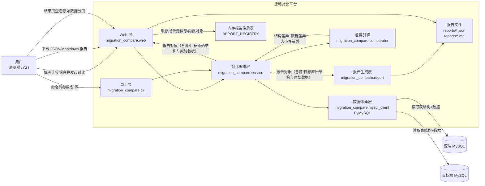
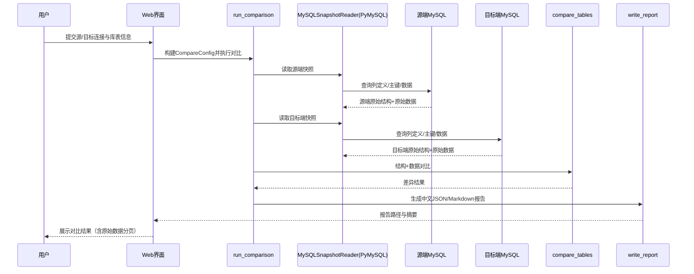

# MySQL 迁移数据端到端对比平台

用于数据库迁移验证场景：对比源端 MySQL 与目标端 MySQL 的表结构和数据，输出清晰的差异报告（**严格区分大小写**）。

## 功能特性

1. 通过填写 IP、端口、用户名、密码登录源端和目标端 MySQL。
2. 通过填写源端库名和表名，自动抓取表结构和数据。
3. 通过填写目标端库名和表名，自动抓取表结构和数据。
4. 执行端到端对比：
   - 表结构对比（列名、类型、可空、默认值、字符集/排序规则、顺序等）
   - 数据对比（优先按主键逐行比较，无法对齐主键时退化为多重集比较）
5. 输出对比报告（JSON + Markdown），标记不一致位置。
   - 报告字段和内容为中文
   - 报告包含源端/目标端的原始查询结构与原始数据
6. 提供 Web 可视化界面，可在页面中填写源/目标信息并查看报告。

---

## 平台架构图





---

## 安装

```bash
python -m venv .venv
source .venv/bin/activate
pip install -e .
```

## 使用方式

### 方式一：配置文件（推荐）

1. 复制并修改示例文件：

```bash
cp config.example.json config.json
```

2. 运行：

```bash
python -m migration_compare.cli --config config.json
```

### 方式二：命令行参数

```bash
python -m migration_compare.cli \
  --source-host 10.0.0.11 --source-port 3306 --source-user user1 --source-password pass1 --source-db db1 --source-table orders \
  --target-host 10.0.0.12 --target-port 3306 --target-user user2 --target-password pass2 --target-db db2 --target-table orders \
  --output-dir reports --max-samples 100
```

### 方式三：交互式填写（缺失项会提示输入）

```bash
python -m migration_compare.cli --interactive
```

---

## Web 可视化界面

启动 Web 服务：

```bash
migration-compare-web --host 127.0.0.1 --port 5000
```

或者：

```bash
python -m migration_compare.web --host 127.0.0.1 --port 5000
```

然后在浏览器打开：

```text
http://127.0.0.1:5000
```

你可以在页面中填写：

- 源端：host、port、user、password、database、table
- 目标端：host、port、user、password、database、table
- 报告目录、样例数量上限

点击 **开始对比** 后可直接查看结构和数据差异，并下载 JSON/Markdown 报告。

结果页支持：

- 全中文显示
- 源端/目标端原始结构与原始数据可折叠查看（避免大数据直接铺开）
- 原始数据分页展示（上一页/下一页 + 每页行数可调）

---

## 报告输出

默认在 `reports/` 目录生成：

- `compare_report_YYYYMMDD_HHMMSS.json`
- `compare_report_YYYYMMDD_HHMMSS.md`

报告包含：

- 表结构一致性结论
- 数据一致性结论
- 缺失行、多出行、行级字段差异样例
- 大小写差异（如 `Alice` vs `alice`）会被识别为不一致
- 源端/目标端原始查询结果（原始表结构 + 原始数据）

---

## 退出码

- `0`：结构和数据均一致
- `2`：对比完成但存在差异
- `1`：执行失败（如连接失败、参数缺失等）

---

## 说明

- 该版本会将整表数据读入内存后再比较，适合中小规模表的迁移验证。
- 对于超大表，可在此基础上扩展为分片/分批比对方案。
